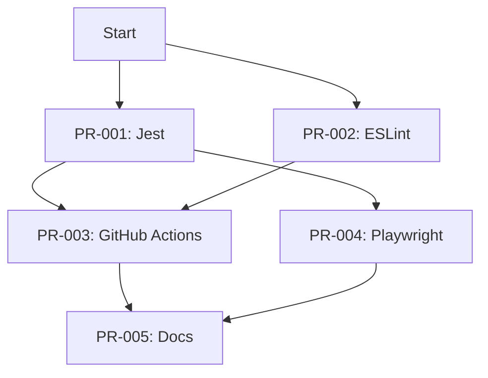
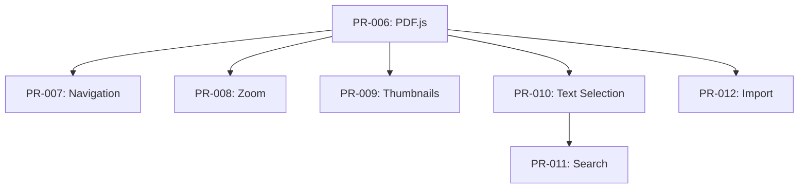
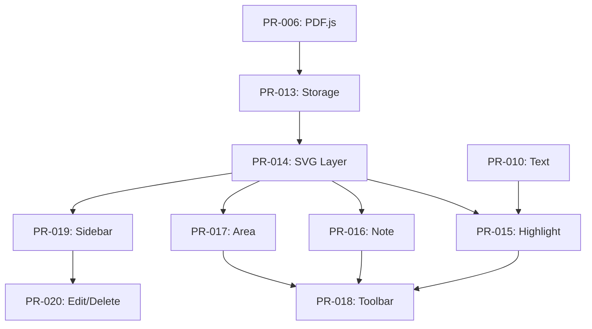
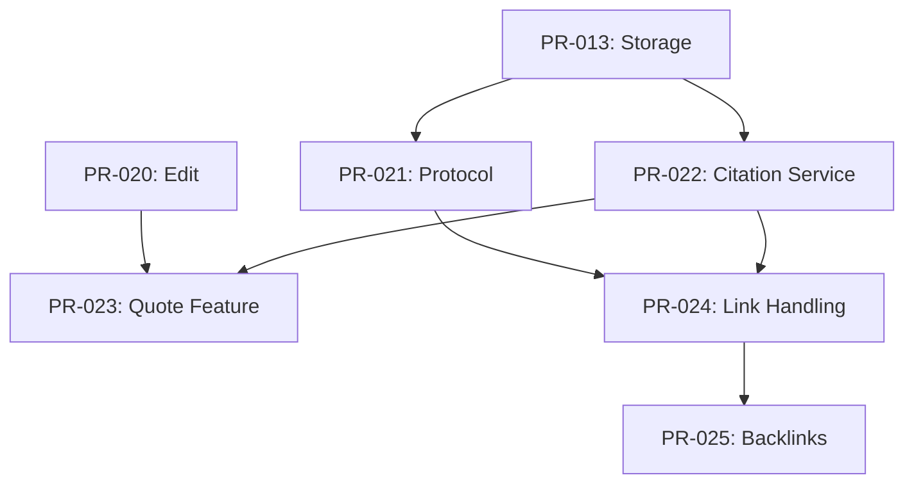
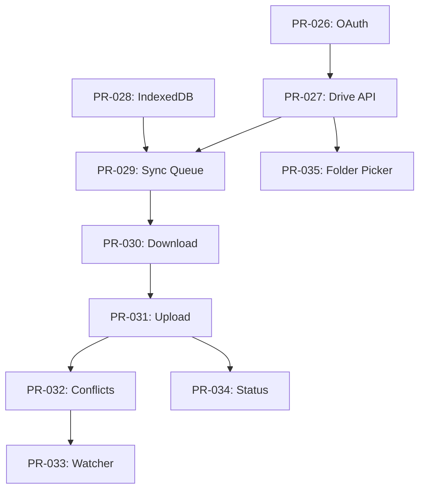
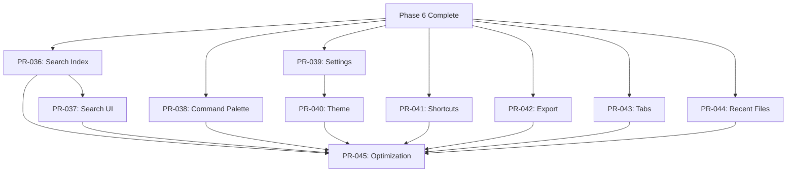
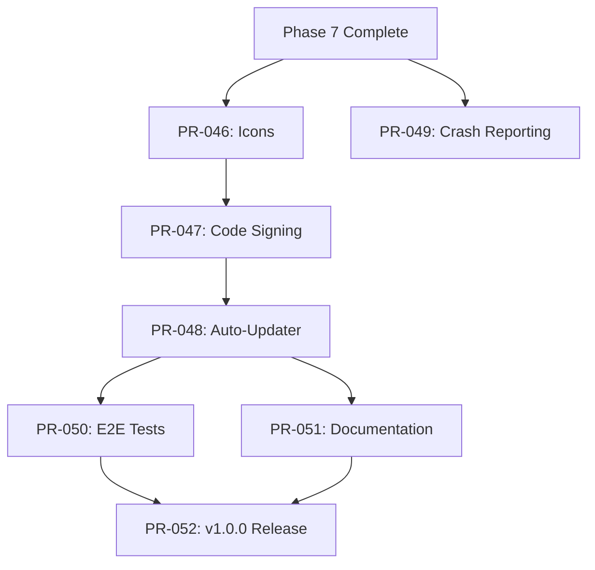

# PR Dependencies & Execution Order Guide

This document helps you manage multiple Claude Code instances working on Noto in parallel. It shows which PRs can be done simultaneously and which must wait for others.

## Quick Reference: PR Execution Order

### Phase 0: Testing Infrastructure (MUST DO FIRST - Week 1-2)

**Sequential (Do in this exact order):**
```
PR-001 → PR-003 → PR-004
```

**Parallel (Can do at same time as PR-001):**
```
PR-002 (ESLint/Prettier)
```

**Final (After all above):**
```
PR-005 (Documentation)
```

### Phase 3: PDF Viewer (Week 3-4)

**Start Here (Must do first):**
```
PR-006 (PDF.js Integration)
```

**Then Parallel (All depend on PR-006):**
```
Instance 1: PR-007 (Page Navigation)
Instance 2: PR-008 (Zoom Controls)
Instance 3: PR-009 (Thumbnails)
Instance 4: PR-010 (Text Selection)
Instance 5: PR-012 (Drag & Drop Import)
```

**After PR-010 (Needs text selection):**
```
PR-011 (PDF Search)
```

### Phase 4: PDF Annotations (Week 5-6)

**Sequential Foundation:**
```
PR-013 (Storage) → PR-014 (SVG Layer)
```

**Then Parallel (All depend on PR-014):**
```
Instance 1: PR-015 (Highlight Tool) - needs PR-010 (text selection)
Instance 2: PR-016 (Note Tool)
Instance 3: PR-017 (Area Tool)
Instance 4: PR-019 (Annotations Sidebar)
```

**After All Above:**
```
PR-018 (Toolbar) - needs PR-015, PR-016, PR-017
PR-020 (Edit/Delete) - needs PR-019
```

### Phase 5: Citation System (Week 7-8)

**Parallel Start:**
```
Instance 1: PR-021 (Protocol Handler)
Instance 2: PR-022 (Citation Service)
```

**Sequential After:**
```
PR-023 (Quote Feature) → PR-024 (Link Handling) → PR-025 (Backlinks)
```

### Phase 6: Google Drive Sync (Week 9-11)

**Critical Path (Sequential):**
```
PR-026 (OAuth) → PR-027 (Drive API) → PR-029 (Sync Queue) →
PR-030 (Download) → PR-031 (Upload) → PR-032 (Conflicts) →
PR-033 (Watcher)
```

**Parallel Opportunities:**
```
While doing PR-027: Start PR-028 (IndexedDB)
While doing PR-030: Start PR-035 (Folder Picker)
After PR-031: Start PR-034 (Status Indicators)
```

### Phase 7: Polish & Features (Week 12-13)

**High Parallelization Possible:**
```
Instance 1: PR-036 (Search Indexing)
Instance 2: PR-038 (Command Palette)
Instance 3: PR-039 (Settings)
Instance 4: PR-041 (Keyboard Shortcuts)
Instance 5: PR-042 (Export)
Instance 6: PR-044 (Recent Files)
Instance 7: PR-043 (Multiple Tabs)
```

**Sequential After:**
```
PR-036 → PR-037 (Search UI)
PR-039 → PR-040 (Theme Toggle)
```

**Final (After everything):**
```
PR-045 (Performance Optimization)
```

### Phase 8: Build & Distribution (Week 14-16)

**Parallel Start:**
```
Instance 1: PR-046 (Icons)
Instance 2: PR-049 (Crash Reporting - optional)
```

**Sequential:**
```
PR-046 → PR-047 (Code Signing) → PR-048 (Auto-Updater)
```

**Parallel Final:**
```
Instance 1: PR-050 (E2E Tests)
Instance 2: PR-051 (Documentation)
```

**Release:**
```
PR-050 + PR-051 → PR-052 (v1.0.0 Release)
```

---

## Detailed Dependency Chart

### Phase 0: Testing Infrastructure



**Legend:**
- Arrows show dependencies (PR at arrow end depends on PR at arrow start)
- PRs at same level with no connecting arrows can be done in parallel

### Phase 3: PDF Viewer



### Phase 4: Annotations



### Phase 5: Citations



### Phase 6: Sync (Critical Path)



### Phase 7: Polish (Highly Parallel)



### Phase 8: Distribution



---

## Instance Assignment Strategies

### Strategy 1: Role-Based (6 Instances)

Assign instances to "own" specific subsystems:

**Instance 1 - Testing Lead:**
- PR-001, PR-003, PR-004, PR-050

**Instance 2 - UI/UX Lead:**
- PR-002, PR-005, PR-038, PR-039, PR-040, PR-043, PR-051

**Instance 3 - PDF Lead:**
- PR-006, PR-007, PR-011, PR-014, PR-015, PR-018

**Instance 4 - Sync Lead:**
- PR-026, PR-027, PR-029, PR-030, PR-031, PR-032

**Instance 5 - Features Lead:**
- PR-021, PR-022, PR-023, PR-036, PR-037, PR-041

**Instance 6 - Build Lead:**
- PR-046, PR-047, PR-048, PR-052

**Floaters (any instance when available):**
- PR-008, PR-009, PR-010, PR-012, PR-016, PR-017, PR-019, PR-020, PR-024, PR-025, PR-028, PR-033, PR-034, PR-035, PR-042, PR-044, PR-045, PR-049

### Strategy 2: Wave-Based (10+ Instances)

Launch instances in "waves" for maximum parallelization:

**Wave 1 (Week 1 - Sequential):**
- 2 instances: PR-001, PR-002 (parallel)
- Then 1 instance: PR-003
- Then 1 instance: PR-004
- Then 1 instance: PR-005

**Wave 2 (Week 3 - PDF Foundation):**
- 1 instance: PR-006 (must complete first)
- Then 5 instances: PR-007, PR-008, PR-009, PR-010, PR-012 (parallel)
- Then 1 instance: PR-011

**Wave 3 (Week 5 - Annotations):**
- 1 instance: PR-013
- 1 instance: PR-014
- Then 4 instances: PR-015, PR-016, PR-017, PR-019 (parallel)
- Then 2 instances: PR-018, PR-020

**Wave 4 (Week 7 - Citations):**
- 2 instances: PR-021, PR-022 (parallel)
- Then 3 instances: PR-023, PR-024, PR-025 (mostly sequential)

**Wave 5 (Week 9-11 - Sync):**
- Sequential critical path: 1 instance does PR-026 → PR-027 → PR-029 → PR-030 → PR-031 → PR-032
- Parallel: 3 instances do PR-028, PR-033, PR-034, PR-035 when dependencies clear

**Wave 6 (Week 12-13 - Polish):**
- 7+ instances in parallel: PR-036, PR-038, PR-039, PR-041, PR-042, PR-043, PR-044
- Then 2 instances: PR-037, PR-040
- Finally 1 instance: PR-045

**Wave 7 (Week 14-16 - Release):**
- 2 instances: PR-046, PR-049 (parallel)
- 1 instance: PR-047 → PR-048
- 2 instances: PR-050, PR-051 (parallel)
- 1 instance: PR-052

### Strategy 3: Critical Path Focus (Minimum Time)

For fastest completion, always keep the critical path moving:

**Critical Path (Cannot parallelize):**
1. PR-001 (Jest)
2. PR-003 (CI)
3. PR-004 (E2E)
4. PR-006 (PDF.js)
5. PR-013 (Annotation Storage)
6. PR-014 (SVG Layer)
7. PR-026 (OAuth)
8. PR-027 (Drive API)
9. PR-029 (Sync Queue)
10. PR-030 (Download)
11. PR-031 (Upload)
12. PR-032 (Conflicts)
13. PR-047 (Code Signing)
14. PR-048 (Auto-Updater)
15. PR-052 (Release)

**Assign your most experienced instance to always work on critical path.**

**All other instances work on parallel tasks.**

---

## Blocking Relationships

### "Blockers" (PRs that block many others)

These PRs should be prioritized as they unlock many parallel tasks:

1. **PR-001** (Jest) - Blocks: PR-003, PR-004 (all testing)
2. **PR-006** (PDF.js) - Blocks: All of Phase 3 & 4 (14 PRs)
3. **PR-014** (SVG Layer) - Blocks: PR-015, PR-016, PR-017, PR-019 (4 PRs)
4. **PR-026** (OAuth) - Blocks: All of Phase 6 (9 PRs)
5. **PR-039** (Settings) - Blocks: PR-040 (theme)

### "Enablers" (PRs that unlock high-value features)

1. **PR-010** (Text Selection) - Enables PDF search & highlights
2. **PR-022** (Citation Service) - Enables the core citation workflow
3. **PR-031** (Upload Sync) - Enables full two-way sync
4. **PR-047** (Code Signing) - Enables Windows installer distribution

---

## Coordination Tips

### For Managing Multiple Instances:

1. **Start with the critical path** - Always have one instance on PR-001 → PR-003 → PR-004 → PR-006, etc.

2. **Branch naming** - Use consistent names:
   - `feature/PR-001-jest-setup`
   - `feature/PR-002-eslint-prettier`

3. **Status tracking** - Create a simple spreadsheet:
   ```
   PR # | Status | Instance | Started | Completed
   001  | Done   | Inst-1   | Jan 1   | Jan 2
   002  | Done   | Inst-2   | Jan 1   | Jan 2
   003  | WIP    | Inst-1   | Jan 2   | -
   ```

4. **Daily sync** - Check which PRs completed, assign next ones

5. **Merge order** - Merge PRs in dependency order:
   - PR-001 before PR-003
   - PR-006 before PR-007
   - Always merge dependencies first

6. **Testing** - After merging a blocker PR, verify it works before starting dependent PRs

7. **Communication file** - Create `INSTANCE_STATUS.md`:
   ```markdown
   # Current Instance Status

   ## Instance 1 (Testing Lead)
   - Current: PR-003 (GitHub Actions)
   - Blocked: No
   - ETA: 4 hours

   ## Instance 2 (UI Lead)
   - Current: PR-002 (ESLint)
   - Blocked: No
   - ETA: 2 hours

   ## Available PRs:
   - PR-005 (ready after PR-003, PR-004)
   ```

---

## Quick Decision Matrix

Use this when deciding what to assign next:

```
IF critical path is blocked → Work on parallel tasks
IF critical path is free → Assign best instance to critical path
IF multiple instances idle → Check Phase dependency chart, assign parallel tasks
IF PR completes → Immediately assign dependent PRs
IF blocker PR completes → Notify all instances, reassign priorities
```

---

## Estimated Timeline by Strategy

### Sequential (1 instance):
- **Total time:** ~20-24 weeks

### Role-Based (6 instances):
- **Total time:** ~12-14 weeks
- **Efficiency:** ~60% reduction

### Wave-Based (10 instances):
- **Total time:** ~10-12 weeks
- **Efficiency:** ~70% reduction
- **Recommended for fastest completion**

### Critical Path Focus (8-10 instances):
- **Total time:** ~8-10 weeks
- **Efficiency:** ~75% reduction
- **Requires careful coordination**

---

## Phase-by-Phase Assignment Recommendations

### Week 1-2: Phase 0 (Testing)
**Assign:** 2-3 instances
**Focus:** Get foundation right, no rushing

### Week 3-4: Phase 3 (PDF)
**Assign:** 5-6 instances
**High parallelization opportunity**

### Week 5-6: Phase 4 (Annotations)
**Assign:** 4-5 instances
**Medium parallelization**

### Week 7-8: Phase 5 (Citations)
**Assign:** 2-3 instances
**Mostly sequential**

### Week 9-11: Phase 6 (Sync)
**Assign:** 3-4 instances
**Complex, needs careful coordination**

### Week 12-13: Phase 7 (Polish)
**Assign:** 6-8 instances
**Maximum parallelization opportunity**

### Week 14-16: Phase 8 (Distribution)
**Assign:** 3-4 instances
**Some parallelization, some sequential**

---

## Emergency Procedures

### If a PR is taking too long:
1. Check for blockers/dependencies
2. Consider splitting into smaller PRs
3. Reassign to different instance
4. Pair two instances on complex PR

### If PR fails CI:
1. Halt dependent PRs immediately
2. Fix the failing PR first
3. Re-test before continuing

### If merge conflicts:
1. Pause all dependent work
2. Resolve conflicts carefully
3. Re-test affected functionality
4. Resume dependent PRs

---

## Next Steps

1. **Read this entire guide** to understand dependencies
2. **Choose a strategy** (Role-Based recommended for 6 instances)
3. **Start with PR-001** (Jest setup) - This is your foundation
4. **Track progress** using the coordination tips above
5. **Refer to [PR_ROADMAP.md](PR_ROADMAP.md)** for detailed PR specifications

**Remember:** The critical path cannot be parallelized. Always keep it moving forward while maximizing parallel work on non-critical tasks.
